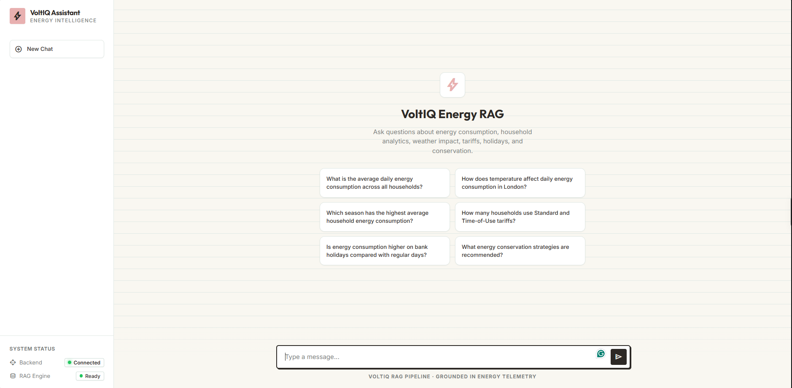

# ⚡ VoltIQ - Energy Intelligence RAG

An AI-powered **Hybrid RAG (Retrieval-Augmented Generation)** system for answering energy-related questions using both **unstructured documents** and **structured energy datasets**.

## 📸 Interface


*(Note: Please save your screenshot as `assets/voltiq-ui.png` to display it here)*

The system combines document retrieval, tabular analytics, vector search, query routing, and an LLM to provide data-driven answers through a custom, fast, and responsive web interface.

---

## 🚀 Features

- **Custom Web Interface**: Modern, responsive UI built with pure HTML/CSS/JS served via FastAPI.
- **Low-Memory Footprint**: Uses `fastembed` for blazing-fast, local embedding generation without the massive PyTorch overhead, making it perfect for free-tier deployments.
- **Intelligent Query Routing**: Dynamically routes questions between document retrieval and tabular analytics.
- **Hybrid LLM Backend**: Primary reasoning powered by Groq, with an automatic failover to OpenRouter.
- **Persistent Vector Search**: Built-in ChromaDB for fast and reliable document retrieval.
- **Energy Analytics**: Understands energy conservation, consumption analytics, weather impacts, and tariff comparisons.

---

## 📊 Data Sources & Capabilities

VoltIQ is grounded in specific, real-world data and documents. It can instantly answer questions based on:

1. **London Household Energy Data (Tabular)**: Analytics on average daily energy consumption across thousands of households, including the impacts of weather, seasons, and bank holidays.
2. **Energy Tariffs**: Comparisons between Standard and Time-of-Use tariffs.
3. **Conservation Documents (PDF/TXT)**: Unstructured knowledge base containing expert recommendations, tips, and strategies for industrial and residential energy conservation.

Whenever you ask a question, the AI intelligently decides whether to run mathematical queries on the tabular data or perform a vector search across the documents to find your answer!

---

## 🛠️ Tech Stack

- **Backend**: FastAPI (Python)
- **Frontend**: HTML5, CSS3, Vanilla JavaScript
- **Vector Database**: ChromaDB
- **Embedding Engine**: FastEmbed (BAAI/bge-small-en-v1.5)
- **LLM Providers**: Groq API, OpenRouter API
- **Data Processing**: Pandas

---

## 🧠 System Architecture

```text
                     User Question (Web UI)
                               │
                               ▼
                        FastAPI Server
                               │
                               ▼
                        Query Router
                               │
                ┌──────────────┴──────────────┐
                ▼                             ▼
         Document Queries                Data Queries
                │                             │
                ▼                             ▼
  FastEmbed (bge-small-en-v1.5)        Pandas Analytics
                │                             │
                ▼                             ▼
         Chroma Vector DB                Data Processing
                │                             │
                └──────────────┬──────────────┘
                               ▼
                    Combined Context / Data
                               │
                               ▼
                       LLM Generation
                (Groq -> Fallback OpenRouter)
                               │
                               ▼
                        Generated Answer
                               │
                               ▼
                          VoltIQ UI
```

---

